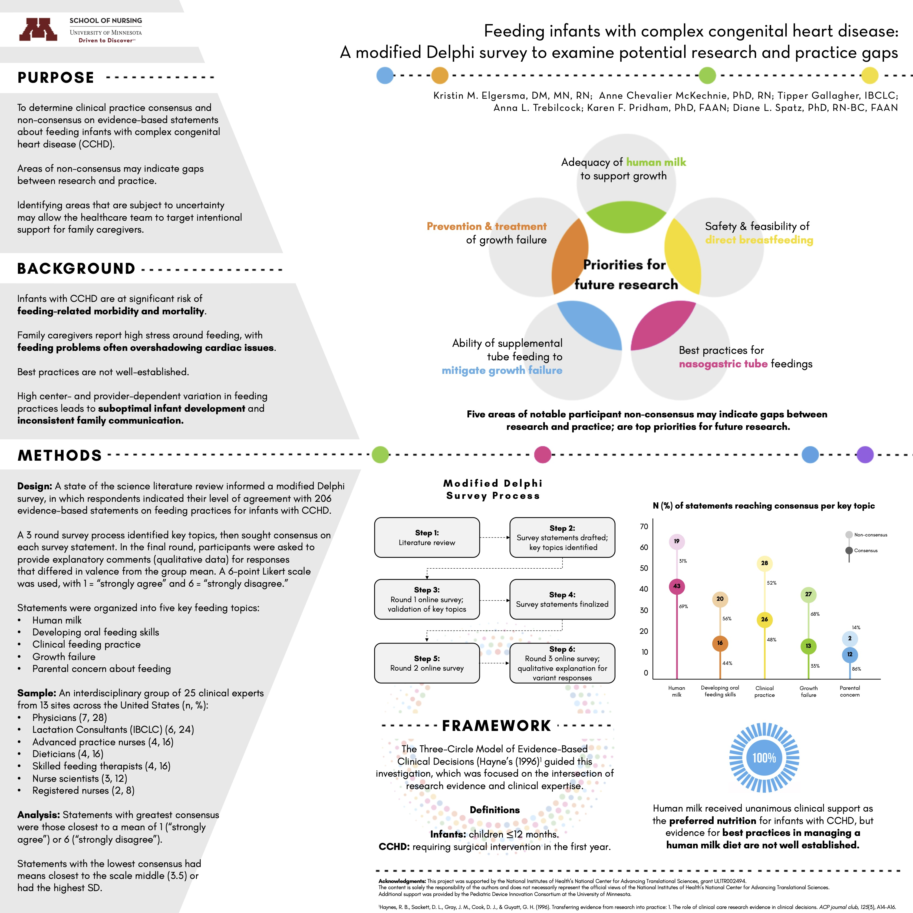

```{r setup, include=FALSE}
library(knitr)
opts_chunk$set(echo = TRUE)
```
\
<font size = "4.5"> 
Please visit [my Google Scholar page](https://scholar.google.com/citations?hl=en&user=sJ61GkMAAAAJ&view_op=list_works&authuser=1&sortby=pubdate) for an up-to-date list of publication. 
\

**Recent conference posters** can be seen below:

1. Wayfinding through the "ocean of the great unknown": How lactating parents establish a direct breastfeeding relationship with an infant with critical congenital heart disease
<body style="background-color:#EAEDF2;">

```{r wayfinding poster, echo=FALSE, fig.align='center', message=FALSE}
include_graphics("images/wayfinding_poster.jpg")
```
<br/><br/>

2. Feeding infants with complex congenital heart disease: A modified Delphi survey to examine potential research and practice gaps
<body style="background-color:#EAEDF2;">

```{r delphi poster, echo=FALSE, fig.align='center', message=FALSE}

```

</font>
