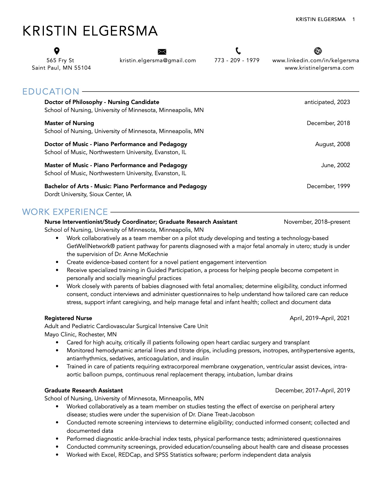
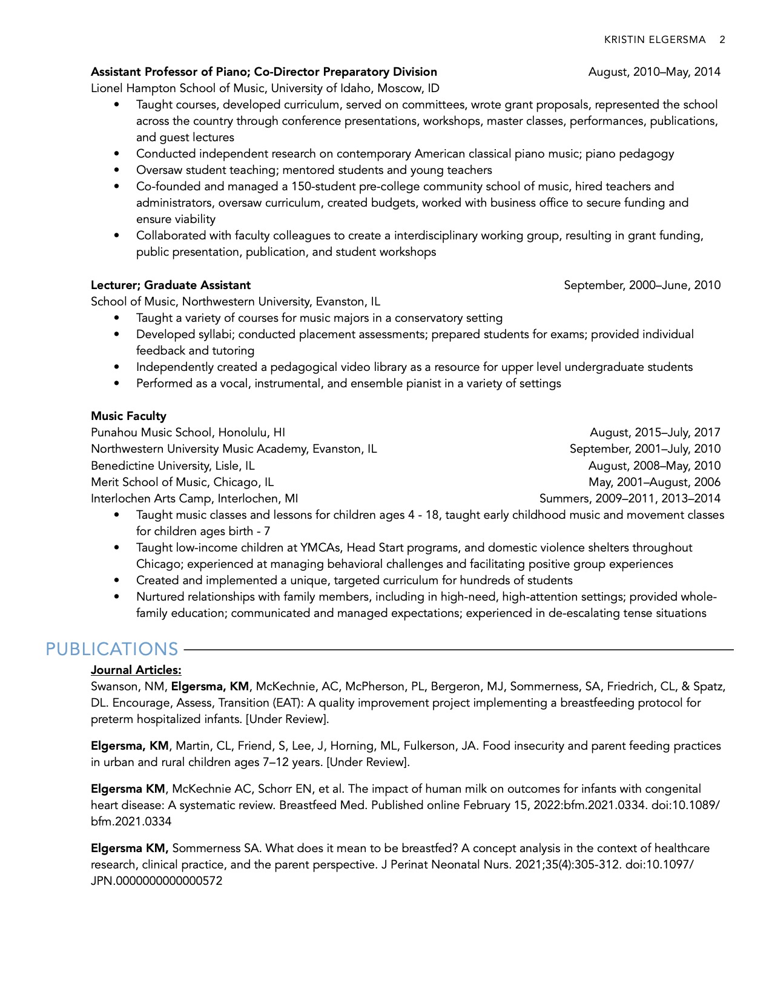
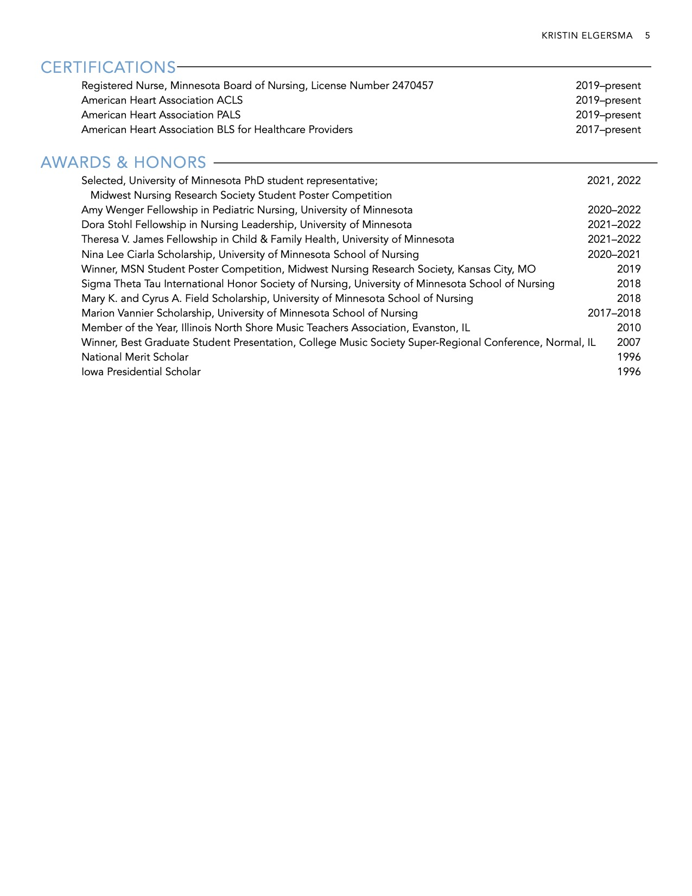

```{r image-ref-for-in-text, echo = FALSE, message=FALSE, fig.align='center', out.width='0.75\\linewidth', fig.pos='H'}

```

```{r image2-ref-for-in-text, echo = FALSE, message=FALSE, fig.align='center', out.width='0.75\\linewidth', fig.pos='H'}

```

```{r image3-ref-for-in-text, echo = FALSE, message=FALSE, fig.align='center', out.width='0.75\\linewidth', fig.pos='H'}
knitr::include_graphics("images/cv_3.jpg")
```

```{r image4-ref-for-in-text, echo = FALSE, message=FALSE, fig.align='center', out.width='0.75\\linewidth', fig.pos='H'}

```

```{r image5-ref-for-in-text, echo = FALSE, message=FALSE, fig.align='center', out.width='0.75\\linewidth', fig.pos='H'}

```