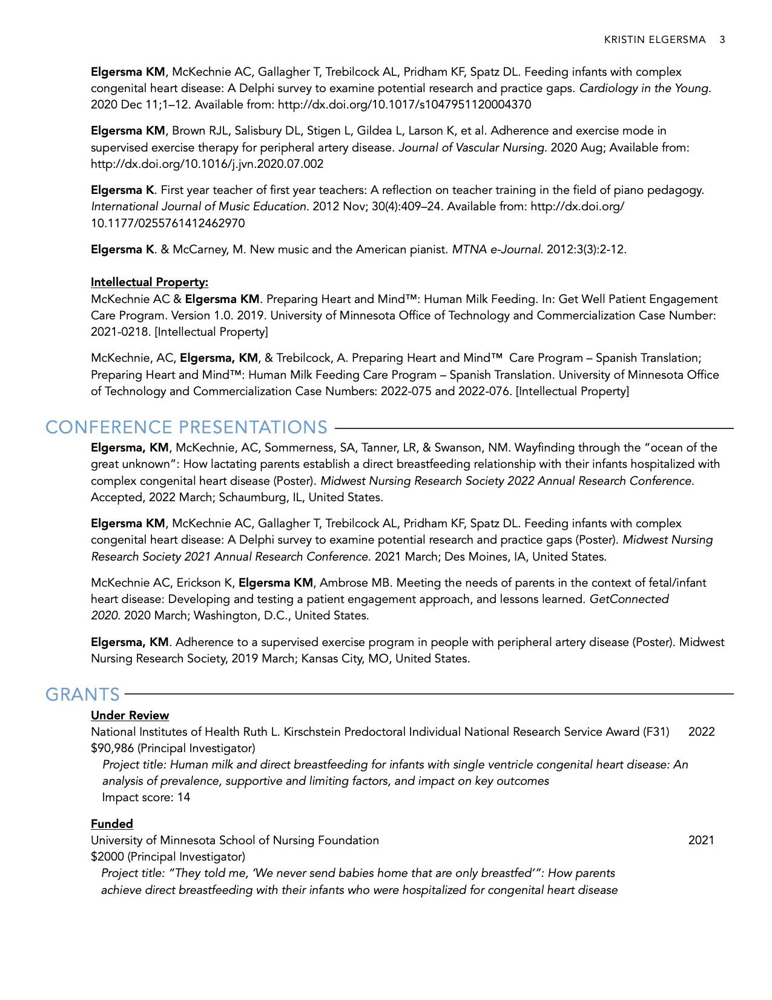

<body style="background-color:#EAEDF2;">
```{r setup, include=FALSE}
library(knitr)
opts_chunk$set(echo = TRUE)
```

```{r cv_1, echo=FALSE, fig.align='center', message=FALSE}

```

```{r cv_2, echo=FALSE, fig.align='center', message=FALSE}
knitr::include_graphics("images/cv_2.jpg")
```

```{r cv_3, echo=FALSE, fig.align='center', message=FALSE}

```

```{r cv_4, echo=FALSE, fig.align='center', message=FALSE}
knitr::include_graphics("images/cv_4.jpg")
```

```{r cv_5, echo=FALSE, fig.align='center', message=FALSE}

```